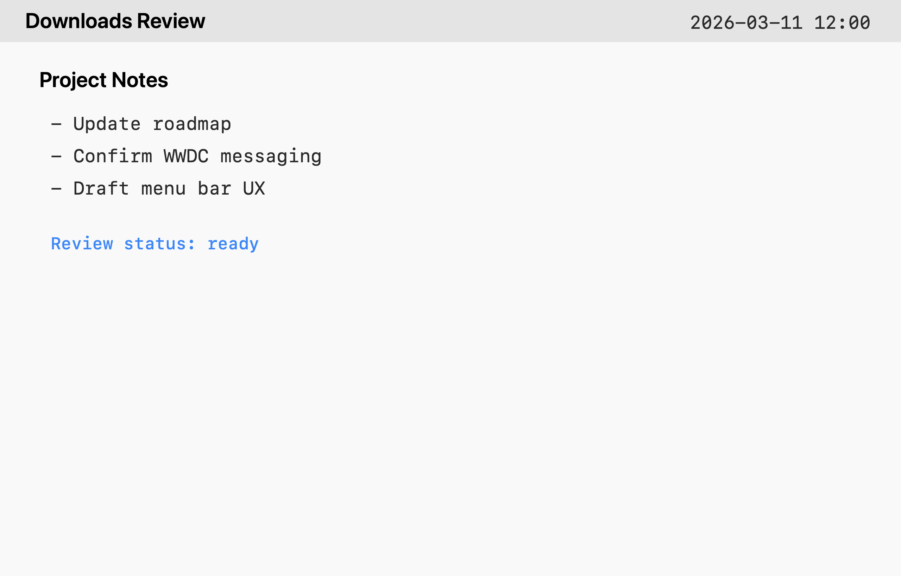

# Apple Local Organizer

Apple Intelligence の Foundation Models と Vision を使って、ローカル要約と Finder 整理提案を行う macOS 向けプロジェクトです。
クリップボード、テキスト、PDF、画像を日本語で要約し、`Desktop` / `Downloads` の整理候補をレビューできます。



このリポジトリは現在、開発者向けの public preview 段階です。
配布は `ad-hoc` 署名のプレビューを前提に進めており、Developer ID 署名と notarization は後段で差し替え可能な構成にしています。
起動後はメニューバー常駐アプリとして動作し、対応ファイルは Finder の右クリックから `このアプリで開く` で要約できます。対応アプリでは、選択テキストの右クリック `サービス` からも要約でき、結果は Recent Results とクリップボードにも残ります。さらに Desktop / Downloads の監視、スクリーンショット要約、PDF 受信箱ウォッチ、クリップボードインサイト、Finder タグ提案も常駐で動かせます。

## 何ができるか

- クリップボードの内容を日本語で要約
- テキスト / Markdown / PDF / 画像ファイルの日本語要約
- OCR-only PDF やスクリーンショットからの文字抽出
- `Desktop` / `Downloads` の整理候補フォルダを提案し、そのまま移動
- すべてをローカル実行前提で扱うワークフロー
- 対応ファイルを Finder の右クリックから直接要約
- 対応アプリの選択テキストを右クリックの `サービス` から要約
- Desktop / Downloads の新着監視と自動レビュー更新
- スクリーンショットの常駐要約、Downloads 内 PDF の受信箱ウォッチ
- クリップボードの長文インサイト要約
- Finder タグ候補の提案と、移動時のタグ適用

## 現在の位置づけ

- 実装は動作するが、一般配布より先に開発者プレビューとして公開している段階
- Finder 整理はレビュー後にそのまま移動まで実行できる
- 常駐 watcher は Preferences から個別に有効 / 無効を切り替えられる
- macOS 実機で Foundation Models / Vision が使えることを前提にしている
- GitHub Releases に載せる DMG は、現時点では `ad-hoc` 署名のプレビュー配布を想定

## 動作要件

- Apple Silicon Mac
- `macOS 15+` でシェル起動
- `macOS 26+` かつ Apple Intelligence 有効環境で AI 機能を有効化
- Python `3.10+`
- 開発時は Xcode / Command Line Tools

AI 機能を使う場合は、Apple の `apple-fm-sdk` と Vision / Foundation Models が利用可能な環境が必要です。

## リポジトリ構成

- `core/`
  Python コア。要約、環境判定、取り込み、整理提案、履歴管理、JSON ブリッジを含みます。
- `shell/`
  SwiftUI/AppKit のメニューバーシェル。Python コアを subprocess で呼びます。
- `fixtures/`
  テスト用のサンプル生成スクリプトと生成先です。
- `release/`
  `.app` / `.dmg` 組み立て、署名、notarization 用スクリプト群です。
- `validation/`
  実機確認メモと検証レポート用テンプレートです。

## 開発者向け最短手順

```bash
python3 fixtures/generate_fixtures.py
PYTHONPATH=core/src python3 -m unittest discover -s core/tests -v
swift build --package-path shell
```

この環境では `swift test` が使えないことがあるため、最小確認は `swift build` を基準にしています。

## CLI 例

```bash
PYTHONPATH=core/src python3 -m ailocaltools.cli check-environment
PYTHONPATH=core/src python3 -m ailocaltools.cli summarize-clipboard
PYTHONPATH=core/src python3 -m ailocaltools.cli summarize-file fixtures/generated/sample_notes.md
PYTHONPATH=core/src python3 -m ailocaltools.cli scan-folder ~/Downloads
PYTHONPATH=core/src python3 -m ailocaltools.cli list-recent
PYTHONPATH=core/src python3 -m ailocaltools.cli validate-device --report validation/reports/device-report.json
```

`apple-fm-sdk` が使えない環境では、シェルは互換モードになり、AI 機能は無効として扱います。
Foundation Models / Vision の実機検証は、通常の Terminal か sandbox 外の実行環境で行ってください。

## 配布と公開

開発者向けプレビュー DMG は、Developer ID がなくても `ad-hoc` 署名で作成できます。

```bash
release/build_app.sh
DEVELOPER_ID_APP=- release/sign_app.sh
release/package_dmg.sh
release/prepare_github_release.sh --tag "preview-YYYY-MM-DD"
```

正式配布へ切り替える場合は、Developer ID 署名と notarization を同じ release フローに差し替えます。
公開の実務手順は [PUBLISHING.md](/Users/taso/開発/オンデバイスAI/PUBLISHING.md) にまとめています。

## ライセンス

このリポジトリのソースコードは [Apple Local Organizer Community License 1.0](/Users/taso/開発/オンデバイスAI/LICENSE) です。

- 個人利用、教育利用、研究利用、評価目的での利用は許可します
- 商用利用は含みません
- 商用利用を希望する場合は、事前にリポジトリ所有者へ問い合わせてください

そのため、このリポジトリは OSI 承認のオープンソースではなく、source-available の扱いです。
また、Apple の SDK・フレームワーク・同梱しない外部 runtime には、それぞれの利用条件が適用されます。

## 商用利用について

商用利用の相談は、まず GitHub Issues / Discussions / プロフィール経由の連絡を前提にしています。
有償サービスへの組み込み、社内業務での本番利用、SaaS / API 提供、販売物への同梱などは、事前問い合わせの対象です。

## フィードバック

不具合報告は GitHub Issues を使ってください。
使い方の質問や改善アイデアの整理先としては GitHub Discussions を想定していますが、現時点では未有効のため、当面は Issues にまとめてください。
